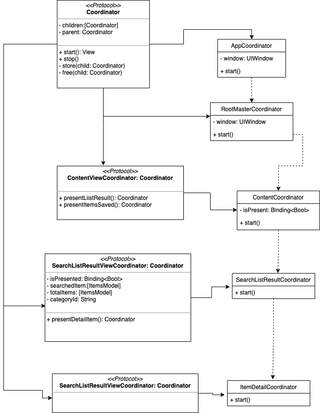
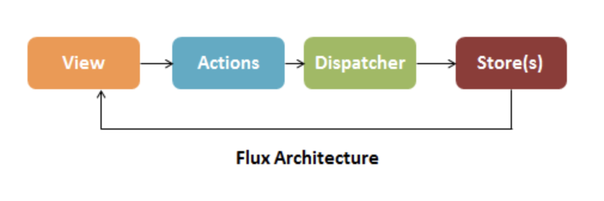

# Prueba MELI

Esta App está inspirada en el nuevo paradigma de programación que suguiere la nueva onda de desarollo Apple **Reactive functional Programming**. Asi como en el uso de la ciencia de datos más popular del momento, **Machine Learning**, para seccionar tendencias de busqueda del usuario (Modelo entrenado para clasificar telefonos iphone y samsung). Se usa FLUX, una arquitectura especialmente diseñada para paradigmas Reactivos. Para la implementación del paradigma Reactivo se usa la libreria oficial de apple **Combine** junto con la nueva libreria de UI **SwiftUI**, la cual nos invita a un nuevo paradigma de programación descriptiva en el mundo Apple. Tambien se hace wrapper de componentes UIKit para ser usado correctamente en el paquete de SwiftUI. 

*(Xcode Version 12.4, iOS 14)*

La documentación se divide en dos partes:

* **Caracteristicas del App** donde se explicarán los componentes y secciones del app.
* **Arquitectura** donde profundizamos conceptos de arquitectura y algoritmos con implementaciones destacadas.


# Características del App

* **Portrait**


* **Landscape**


* **Dark Mode**


La Aplicación se compone de tres secciones, **Home, Lista de resultados, Detalle producto**.

### Home

En esta sección hay 3 modulos en funcionamiento. Dependiendo la posición del celular se acomodan diferente los módulos (Portrait, Landscape).

* **Buscador** (UIKit component), luego que se ha buscado un producto automaticamente en la siguiente busqueda carga el historico de busquedas realizadas.

* **Banner Publicitario** el cual trabaja con **Machine Learning**, cada vez que se va al detalle del producto se guarda el titulo del producto en base de datos local **CoreData** luego se recuperan esos titulos y se envian al modelo de maching learning para que nos diga qué producto es ( el entrenamiento del modelos solo se hizo con iPhone y samsung), cualquier producto de estas marcas el modelo lo clasifica en la marca correspondiente. Según la cantidad de busquedas de cada marca se saca el promedio y la marca más buscada automaticamente genera un banner promocionando el producto que más busca el usuario.

* **Visto Recientemente** este modulo guarda el último producto que visitó el usuario, adicional tiene link a la lista del histórico de navegación del usuario. Todos estos datos se almacenan y se cargan desde **CoreData**

* **Tendencias de Busqueda** Este modulo funciona muy similar al banner publicitario haciendo uso de maching learning para botarnos los porcentajes de busqueda entre productos iPhone y samsung.


### Lista de resultados

Aquí encontramos una lista la cual puede ser ordenada por precio y cantidad del producto. Genera el producto al que se le dio tap una vista de destacado (background un poco mas gris), para resaltar la busqueda actual en resultados similares.


### Detalle producto

En esta vista se guardan los datos en el data storage local (CoreData) para el correcto funcionamiento en las dos seccioness anteriores en operaciones de histórico y machine learning, adicional tiene un modulo de bandeja desplegable hacia arriba para ver las características del producto. Dependiendo la posición del celular se acomodan diferente los módulos (Portrait, Landscape).


# Arquitectura 

Como arquitectura general se construyó **Coordinator + FLUX + NetworkingLayer + Componentizacion de Elementos UI (UIFreeMarketKit)**.
A continuación se profundizará en cada una de las capas de la arquitectura presentada


## COORDINATOR

Se usa patron Coordinator para el manejo de la navegación entre módulos, el siguiente diagrama muestra la implementación:



Para destacar en la implementación en el protocolo Coordinator **Coordinator.swift** 

```swift
extension Coordinator {
    private(set) var identifier: UUID {
        get {
            guard let identifier: UUID = associatedObject(for: &identifierKey) else {
                self.identifier = UUID()
                return self.identifier
            }
            return identifier
        }
        set { setAssociatedObject(newValue, for: &identifierKey) }
    }
    
    private(set) var children: [UUID: Any] {
        get {
            guard let children: [UUID: Any] = associatedObject(for: &childrenKey) else {
                self.children = [UUID: Any]()
                return self.children
            }
            return children
        }
        set { setAssociatedObject(newValue, for: &childrenKey) }
    }
    
    private(set) weak var parent: P? {
        get { associatedObject(for: &parentKey) }
        set { setAssociatedObject(newValue, for: &parentKey, policy: .weak) }
    }
    
    private func store<T: Coordinator>(child coordinator: T) {
        children[coordinator.identifier] = coordinator
    }
    
    private func free<T: Coordinator>(child coordinator: T) {
        children.removeValue(forKey: coordinator.identifier)
    }
    
    func stop() {
        children.removeAll()
        parent?.free(child: self)
    }
}
```
Vemos el uso de la función **associatedObject** cuya implementación **AssociatedObjects.swift** usa Objective-C para implementar la técnica **Mixins**, la cual consiste en guardar valores y estados a variables en protocolos usando la función **objc_getAssociatedObject**
esto es especialmente útil para estos casos en donde siempre se implementa el mismo protocolo Coordinator y siempre hay que hacer el mismo trabajo de storage... Al usar esta técnica solo se hace una unica vez. 

Importante **private(set) weak var parent** necesario que este en weak para evitar retain cicle, ya que es una relacion 1:1 entre hijo y padre.

## FLUX

Flux es una arquitectura pensada para paradigmas Reactivos con una particularidad bastante interesante, es **Unidireccional**, esto quiere decir que no hay un ida y vuelta entre las capas como en las clásicas arquitecturas con las que se ha trabajado (VIPER, MVVM). Es especialmente útil dado que es bastante ágil de seguir, "¿Qué cambió? ¿Cuál estado?".



### Implementación

Diagrama de implementación


### VIEW

Tiene la siguiente implementación 

```swift
struct ContentView<A: ContentActionsProtocol>: View where A.M == ContentModelStore {
     @ObservedObject var store: ContentModelStore
     private var actions: A

     init(actions: A,  modelStore: ContentModelStore) {
        self.store = modelStore
        self.actions = actions
        self.actions.configureViewStore(modelStore: store)
    }

    var body: some View { 

        Text("El Estado de la varibale store \(store.isLoggedOut)")

    }

   } 
```

Se usa la sentencia **where** para asegurar que la vista solo pueda ser modificada por el store, así mismo se asigna valores junto con el actions. Reactivamente quedan las variables del store en listener, cualquier cambio se verá reflejado en la vista.

### ACTION

Implementación


```swift
class ContentActions<C: ContentViewCoordinator, D: FluxDispatcher>:  Action<C>, ContentActionsProtocol where D.L == ContentListActions {

    private let dispatcher: D
    private var contentViewStore: AnyObject?

      init(coordinator: C, dispatcher: D) {
        self.dispatcher = dispatcher
        super.init(coordinator: coordinator)
    }

    func configureViewStore(modelStore: ContentModelStore) {
        self.contentViewStore = ContentViewStore(dispatcher: self.dispatcher, modelStore: modelStore)
    }

    func login() {
        self.dispatcher.dispatch(.isLoggedOut(true))
    }

     func goToSomewhere(isPresented: Binding<Bool>) -> some View {
        return coordinator?.presentSomewhere(isPresented: isPresented)
    }

   } 
```
Este es el centro de la arquitectura donde se tiene el control del **Coordinator, Dispatcher, Store**. Hereda de **Actions**, el cual tiene referencia del Coordinator para la navegación entre módulos. La función Login disparará el evento para modificar el valor en el Store el cual recibirá la vista. Adicional aseguramos que el Action solo pueda lanzar las acciones que está autorizado con la clausula where.


### DISPATCHER

Implementación

```swift
class Dispatcher<L: ListActions>: FluxDispatcher {
    
    private let actionSubject = PassthroughSubject<L, Never>()
    private var cancellables: [AnyCancellable] = []
    
    func register(callback: @escaping (L) -> ()) {
        let actionStream = actionSubject.sink(receiveValue: callback)
        cancellables += [actionStream]
    }
    
    func dispatch(_ action: L) {
        actionSubject.send(action)
        CLog(action: action)
    }
}
```

El dispatcher queda completamente genérico, recibe una lista de acciones y las dispara para que lo reciba el store.

### STORE

Implementación


```swift
class ModelStore: ObservableObject {
    @Published var isLoggedOut: Bool = true
}

class ViewStore<D: FluxDispatcher, MS: COSOModelStore >: FluxStore where D.L == ListActions {
    
    var modelStore: MS
    var dispatcher: D
    
    required init(dispatcher: D, modelStore: MS) {
        self.dispatcher = dispatcher
        self.modelStore = modelStore
        self.dispatcher.register { [weak self] (ListActions) in
            
            guard let strongSelf = self else { return }
            
            switch ListActions {
            case .isLoggedOut(let value):
                strongSelf.modelStore.isLoggedOut = value
            }
        }
    }
}
```
Se asegura que solo reciba las acciones del dispatch del modulo, el único que puede modificar este store será el dispatch del modulo. Reactivamente apenas se asigna el valor la vista recibe este cambio de estado y dibuja lo que necesite dibujar.


## NetworkingLayer Configuración

El desarrollador es solo debe implementar un archivo de configuración donde asigna los valores que necesita que le retorne la capa de networking.

```swift
class ConfigurationDetailItemService: NetworkConfiguration {
    typealias responseDataType = [DetailRootClass]
    var provider: Provider = .APIRest(serviceItem: .detailItems)
}
```

Este archivo de configuración se inicializa junto con el archivo de casting en la clase que hereda de **NetworkingLayer**, allí recibirá la respuesta de la capa de networking y podrá trabajar con los datos que se necesita lleguen al Action y posterior al Store para que la vista actualice y dibuje lo que necesite.

```swift
final class NetworkingDetailItems: NetworkingLayer {
    
    var configurationService: ConfigurationDetailItemService
    var networkManager: NetworkManager<ConfigurationDetailItemService>
    var castingModel: CastingToItemDetailModels
    var cancellables: Set<AnyCancellable>
    
    init() {
        self.configurationService = ConfigurationDetailItemService()
        self.networkManager = NetworkManager(configuration: self.configurationService)
        self.castingModel = CastingToItemDetailModels()
        cancellables = []
    }
    
    func networkingLayerService(text: String) -> Future<ItemDetailModel?, Never> {
        return Future<ItemDetailModel?, Never> { [weak self, castingModel] promise in
            guard let strongSelf = self else {
                return promise(.success(nil)) // TODO: Logger manage error
            }
            strongSelf.networkManager.getData(text:text).sink {  (response) in
                castingModel.casting(rootClass: response?.first).sink { value in
                    return promise(.success(value))
                }.store(in: &strongSelf.cancellables)
            }.store(in: &strongSelf.cancellables)
        }
    }
    
}
```


Los archivos de configuración se encuentran en la carpeta **ConfigurationFiles**

El Protocolo obliga que la respuesta sea el mismo valor que se settea en el archivo de configuración.

## NETWORKING LAYER

Alojado en la carpeta **NetwokingManager** el componente  esta pensado para ser separado del proyecto principal y dejarlo como una libreria de networking, esta implementado el patron de diseño **Bridge** para manejar los diferentes lugares donde puedo almacenar y obtener data (Mock, APIRest, CoreData), con este patrón aseguramos la implementación de las mismas funciones y cuando se desee cambiar el origen de datos tan solo se le debe decir en el archivo de configuración que origen necesita.

```swift

    var provider: Provider = .APIRest(serviceItem: .detailItems)
    var provider: Provider = .mock(jsonName: "detailItems")
    var provider: Provider = .coreData(coreDataPersistence: .detailItems)

```

Para el manejo de errores se implementa **ParsingError: Error** el cual hereda de Error asi se tiene control de lo que se quiere transmitir.

### Bridge Implementación


Las tres persistencias que trabajan en el sistema son 

* **APIRestPersistence** apunta al API de Mercado Libre

* **CoreDataPresistence** apunta a la base de datos interna implementada con CoreData

* **MockPersistence** apunta a los archivos .json con respuestas mockeadas de los servicios

Adicional APIRest tiene la implementación de Endpoints **APIRestLayerImplementation** configurado con URLComponents.

## Componentizacion de Elementos UI (UIFreeMarketKit)

Alojado en la carpeta **UIFreeMarketKit** pensado para ser una libreria fuera del proyecto principal. Alli se crean todos los componentes visuales re utilizables para ser invocados en las Views de cada modulo. Soporta dark mode.

Para destacar la wrapper al componente de **UIKit UISearchController** para asi lograr una funcionalidad optima en SwiftUI.


## Unit Test

Se implementan en las classes que hacen parsing y llamado a data. Se mockea el archivo de configuración para settearle la opcion **.mock** la cual trae la data de archivos json. 

Para hacer test de core data usamos la base de datos **type = NSInMemoryStoreType** la cual nos permite manejar datos en ejecución y no son persistidos en memoria.


## Logs

Se implementa **Logger** la cual es la herramienta que nos brinda Apple (os.log) para hacer trazabilidad en la aplicación. Es particulamente útil ya que toda la data que se registre queda guardado en un archivo de sistema, asi podemos descargar el archivo y ver todo el flujo que hace un usuario separando por categorias y niveles de registro (trace, info, notice, error, warning, critical).


```swift

    CLogger.log(category: .parsing).error("error: '\(error.localizedDescription)'")
    CLogger.log(category: .url).warning("error: '\(ParsingError.weakself)'")

```

Para destacar la implementación en **ConfigureCategoryCLog** la cual hace una implementación por defecto en el protocolo haciendo la técnica de **Mirror** para conocer quien esta haciendo uso de la funcion y hacer automaticamente el registro de la sección y la data a imprimir en el log. Mirrow es especialmente útil para casos donde tenemos ejecuciones comunes de diferentes clases y queremos saber desde que clase se está ejecutando. 

## CONSIDERACIONES GENERALES

### Imagenes

Para la descarga de imagenes se implementó seguridad https para cualquier url **Allow Arbitrary Loads = NO**, asi que para cargar imagenes se tuvo que hacer llamado en cascada del servicio de busqueda al servicio de detalle producto. Para destacar el uso de la funcion **MergeMany** la cual nos maneja los estados de memoria he hilos internos para multiples llamados en cascada.

Adicionalmente se usa técnica de caching y llamado asíncrono para descargar las imagenes. La implementación la hace **AsyncImage**, crea un hilo secundario **DispatchQueue(label: "image-processing")** y para caching se implementa **NSCache** asi como el uso de **subscript**.

### Arrays y Dictionaries

Se destaca el uso en las clases de casting de la propiedad **lazy** para gestionar la copia en memoria de los elementos mientras usamos Higth Functions para filtros y creación de nuevas entidades.

Se usa **Sort** función nativa para hacer el ordenamiento por características en el filtro de búsqueda. Este algoritmo usa Complexity: O(n log n)

*Estadisticas de carga*


Se implementa la técnica Hashing para encapsular los objetos con una notación algorítmica en memoria y asi optimizar tiempos en busqueda para todas las acciones con arrays y objetos. 

Ejemplo en la implementacion del protocolo Custom Hashable 
```swift

    struct ItemSearchModel: Hashable, Identifiable, Decodable {
    let id: String
    let category: String
    var saved: Bool?
    
    func hash(into hasher: inout Hasher) {
        hasher.combine(category + id)
    }
    
    static func ==(lhs: ItemSearchModel, rhs: ItemSearchModel) -> Bool {
        return lhs.category == rhs.category && lhs.id == rhs.id
    }
}

```

### Machine Learning

Se entrenó el modelo de clasificación de textos **MLTextClassifier** con los primeros Mil resultados de la busqueda que contienen las palabras Samsung y iPhone. Con este aprendizaje el modelo es capaz de clasificar, según el título del producto, si este pertenece a la categoria de iphones o samsungs y asi poder usar esta información para fines de marketing en el banner de destacados.


* Modelo: **ModelMELIPhones.mlmodel**

## Conclusiones

Se implementó el paradigma Reactive Functional programming, junto con la nueva libreria de UI SwiftUI y Combine. La Arquitectura FLUX clarifica mucho más el flujo de datos en el paradigma reactivo. Se pudo entrenar un modelo de Machine Learning para clasificación de productos en su categoria (telefonos iphone, samsung). Se implementaron varias técnicas gestionando el correcto funcionamiento de memoria junto a patrones de diseño para estructurar el App.
